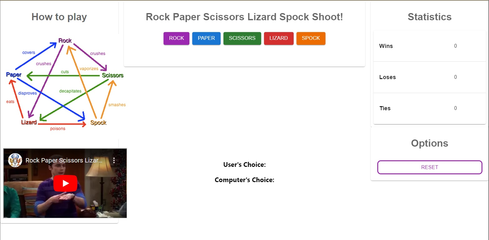

# Rock Paper Scissors Lizard Spock Game

Welcome to the Rock Paper Scissors Lizard Spock Game! This is a one-page web application that allows you to play the classic game with a twist. The game is built using React and programmed with JavaScript, and styled with Material UI. It is deployed on GitHub Pages.

## How to Play

The game has three main parts:

1. **Guide**: This section includes an image and an embedded video that explains how to play the game.
2. **Game Area**: This section includes buttons that allow you to choose your move (rock, paper, scissors, lizard, or spock). Once you make your choice, the computer will make its move and the winner will be determined.
3. **Stats**: This section displays the statistics for wins, losses, and ties for the user. It also includes a reset button that allows you to reset the stats to zero.

To play the game, simply choose your move by clicking on one of the buttons in the game area. The computer will then make its move and the winner will be determined based on the rules of the game. The stats section will keep track of your wins, losses, and ties.

## Technologies Used

- React
- JavaScript
- Material UI
- GitHub Pages

## Deployment

The game is deployed on GitHub Pages. You can access it at [[Deployed Page](https://parisadarkhal.github.io/rock-paper-scissors-lizard-spock/)].

We hope you enjoy playing the Rock Paper Scissors Lizard Spock Game! 😊
